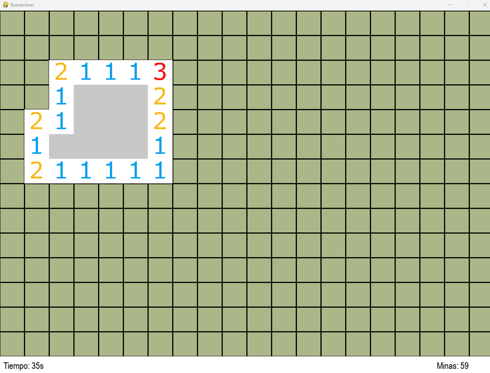
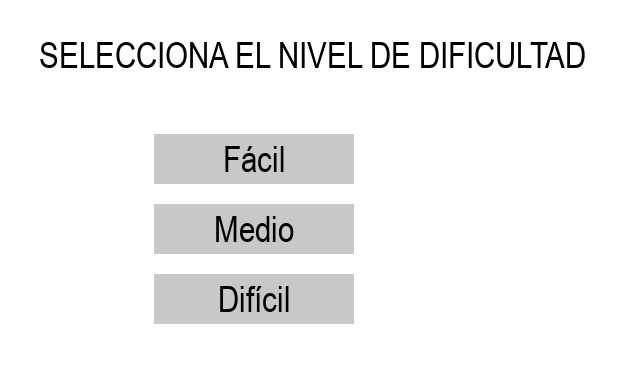
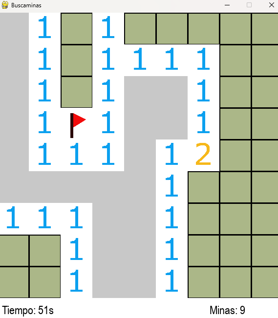
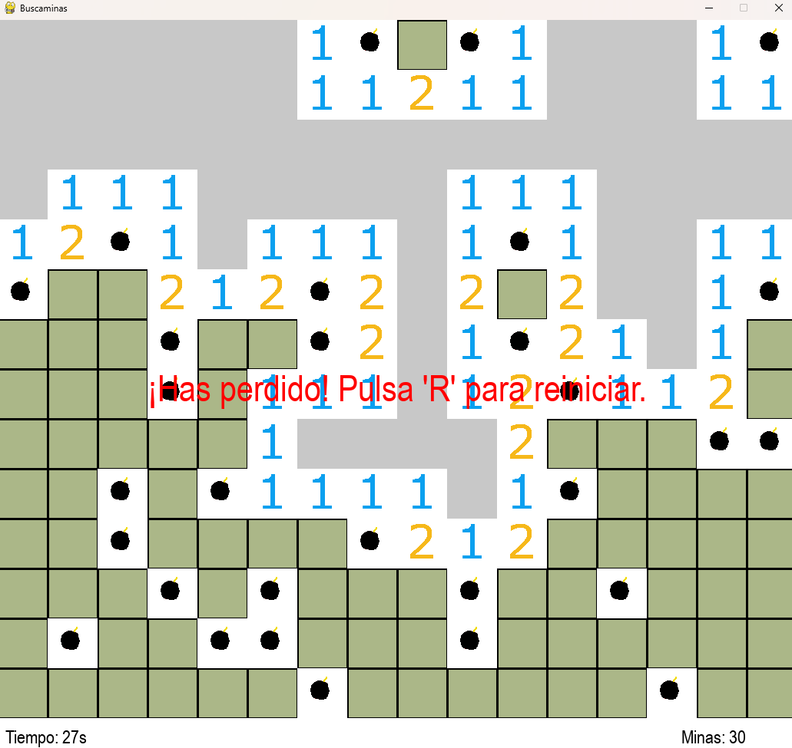

# Buscaminas en Python con Pygame 🕹️

## Descripción

**Buscaminas en Python con Pygame** es una recreación del clásico juego Buscaminas (Minesweeper) desarrollado en Python utilizando la biblioteca [Pygame](https://www.pygame.org/). Este proyecto ofrece una experiencia de juego similar al original. Las imágenes y sonidos utilizados en este proyecto son de uso libre y no tienen copyright.

### Características Principales

- **Niveles de Dificultad Ajustables:** Fácil, Medio y Difícil para adaptarse a todos los niveles de jugadores.
- **Interfaz Gráfica Intuitiva:** Diseñada para una fácil navegación y una experiencia de usuario agradable.
- **Sonidos y Efectos Visuales:** Mejora la inmersión del juego con efectos de sonido al revelar celdas y al descubrir minas.
- **Contador de Tiempo y Banderas:** Muestra el tiempo transcurrido y permite colocar banderas para marcar posibles minas.

## Capturas de Pantalla

*Pantalla principal donde se selecciona el nivel de dificultad.*

*Interfaz del juego en acción, revelando celdas y colocando banderas.*

*Pantalla de fin de juego mostrando la puntuación final.*

## Tecnologías Utilizadas

- **Lenguaje de Programación:** Python 3.6 o superior
- **Biblioteca Gráfica:** Pygame 2.1.2 o superior
- **Sistema Operativo:** Windows 11 (compatible con otros sistemas operativos)

## Requisitos

Antes de ejecutar el juego, asegúrate de tener instalados los siguientes requisitos:

- **Python 3.6 o superior**
- **Pygame 2.1.2 o superior**

### Clonar el Repositorio
    git clone https://github.com/moises60/buscaminas_python.git

### Acceder a la Carpeta
    cd buscaminas_python/src
    
### Ejecutar el Juego
    python3 main.py
